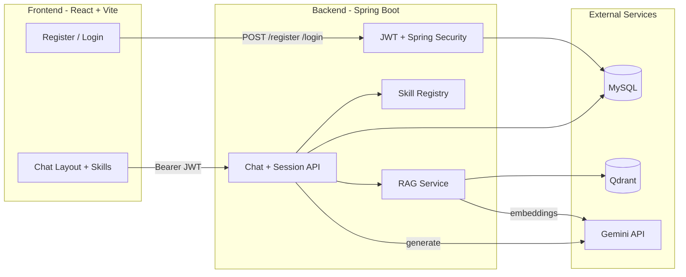
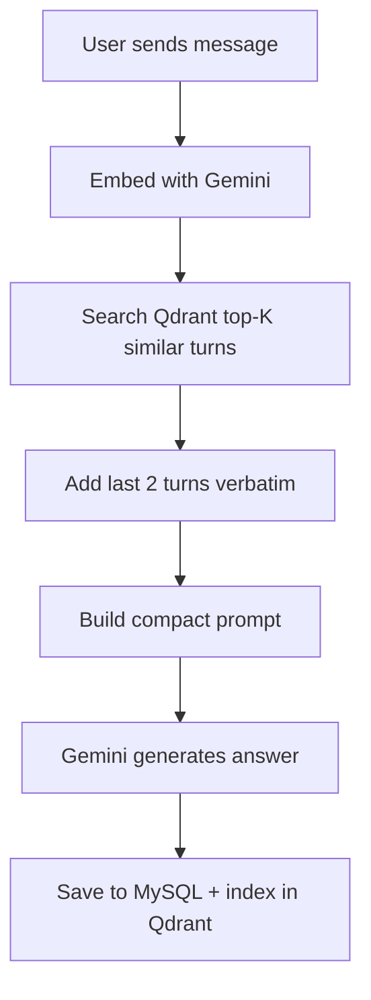

# AI-Powered Chatbot (Master AI)

[](https://openjdk.org/)
[](https://spring.io/projects/spring-boot)
[](https://react.dev/)
[](https://ai.google.dev/)
[](LICENSE)

A full-stack AI chat application powered by **Google Gemini**, with JWT authentication, multi-skill assistants, session-based conversations, and a **RAG pipeline** (Qdrant + embeddings) to optimize token usage on long chats.

**Repository:** [github.com/Sachin0fficial/AI-Powered-Chatbot](https://github.com/Sachin0fficial/AI-Powered-Chatbot)

## Table of Contents

- [Features](#features)
- [Architecture](#architecture)
- [Tech Stack](#tech-stack)
- [Prerequisites](#prerequisites)
- [Quick Start](#quick-start)
- [Environment Variables](#environment-variables)
- [API Reference](#api-reference)
- [Skills Guide](#skills-guide)
- [RAG Pipeline](#rag-pipeline-token-optimization)
- [Security Notes](#security-notes)
- [Project Structure](#project-structure)
- [Roadmap](#roadmap)
- [Author](#author)

## Features

| Feature | Description |
|---------|-------------|
| **Secure auth** | BCrypt passwords, JWT tokens, protected `/api/**` routes |
| **AI skills** | General, Trending Topics, Code, Summarize, Creative Writing |
| **Chat sessions** | Create, browse, and delete per-user conversation threads |
| **Modern UI** | Dark/light theme, markdown rendering, typing indicator, sidebar |
| **Rate limiting** | 20 requests/minute per user on chat endpoint |
| **RAG pipeline** | Qdrant vector search + Gemini embeddings to reduce token usage |

## Architecture



## Tech Stack

| Layer | Technologies |
|-------|-------------|
| Frontend | React 19, Vite 6, Tailwind CSS 4, React Router 7, Axios, react-markdown |
| Backend | Java 23, Spring Boot 3.4, Spring Security, Spring Data JPA, JWT (jjwt) |
| Database | MySQL 8 |
| Vector DB | [Qdrant](https://qdrant.tech/) (Docker, open source) |
| AI | Gemini 1.5 Flash (chat) + text-embedding-004 (RAG) |

## Prerequisites

- [Java 23+](https://openjdk.org/)
- [Node.js 20+](https://nodejs.org/)
- [Docker](https://www.docker.com/) (recommended for MySQL + Qdrant)
- [Google Gemini API key](https://aistudio.google.com/apikey)

## Quick Start

### 1. Clone the repository

```bash
git clone https://github.com/Sachin0fficial/AI-Powered-Chatbot.git
cd AI-Powered-Chatbot
cp .env.example .env
```

Edit `.env` with your values:

| Variable | Description |
|----------|-------------|
| `DB_PASSWORD` | MySQL root password |
| `GEMINI_API_KEY` | Google Gemini API key |
| `JWT_SECRET` | Random string, at least 32 characters |
| `DB_URL` | Optional — defaults to `jdbc:mysql://localhost:3306/chat` |
| `DB_USERNAME` | Optional — defaults to `root` |
| `QDRANT_URL` | Optional — defaults to `http://localhost:6333` |

### 2. Start MySQL and Qdrant

```bash
docker compose up -d
```

| Service | Port | Purpose |
|---------|------|---------|
| MySQL | 3306 | User accounts & chat history |
| Qdrant | 6333 | Vector store for RAG |

If Qdrant is not running, the app still works — it falls back to the last 2 messages only.

### 3. Start the backend

```bash
cd gemini-chat
export GEMINI_API_KEY=your_key
export JWT_SECRET=your-long-random-secret-at-least-32-chars
export DB_PASSWORD=your_mysql_password
./mvnw spring-boot:run
```

Backend: `http://localhost:8080`

### 4. Start the frontend

```bash
cd Frontend
cp .env.example .env
npm install
npm run dev
```

Frontend: `http://localhost:5173`

### 5. Use the app

1. Open `http://localhost:5173` and **register** an account
2. **Sign in** — you'll receive a JWT token
3. Pick a **skill** (General, Code, Trending, etc.)
4. Start chatting — sessions are saved automatically

## Environment Variables

### Backend

| Variable | Required | Default | Description |
|----------|----------|---------|-------------|
| `GEMINI_API_KEY` | Yes | — | Google Gemini API key |
| `JWT_SECRET` | Yes | — | HS256 signing secret (32+ chars) |
| `DB_PASSWORD` | Yes | — | MySQL password |
| `DB_URL` | No | `jdbc:mysql://localhost:3306/chat` | JDBC URL |
| `DB_USERNAME` | No | `root` | MySQL username |
| `QDRANT_URL` | No | `http://localhost:6333` | Qdrant REST API |

### Frontend (`Frontend/.env`)

| Variable | Required | Default | Description |
|----------|----------|---------|-------------|
| `VITE_API_URL` | No | `http://localhost:8080` | Backend API URL |

## API Reference

### Authentication

**POST `/register`**

```json
{
  "name": "Jane Doe",
  "email": "jane@example.com",
  "password": "SecureP@ss1"
}
```

**POST `/login`**

```json
{
  "email": "jane@example.com",
  "password": "SecureP@ss1"
}
```

Response:

```json
{
  "token": "eyJ...",
  "email": "jane@example.com",
  "name": "Jane Doe"
}
```

All `/api/**` endpoints require header: `Authorization: Bearer <token>`

### Chat

| Method | Endpoint | Description |
|--------|----------|-------------|
| `POST` | `/api/qna/ask` | Send a message |
| `GET` | `/api/qna/sessions` | List chat sessions |
| `GET` | `/api/qna/history/{sessionId}` | Load session messages |
| `POST` | `/api/qna/session` | Create new session |
| `DELETE` | `/api/qna/session/{sessionId}` | Delete session + vectors |

**POST `/api/qna/ask`**

```json
{
  "message": "Explain REST APIs",
  "sessionId": "optional-uuid",
  "skill": "general"
}
```

Response:

```json
{
  "answer": "REST APIs are...",
  "sessionId": "uuid-of-session"
}
```

### Skills

**GET `/api/skills`** — Returns all available AI skills

## Skills Guide

| Skill ID | Name | Best For | Example Prompt |
|----------|------|----------|----------------|
| `general` | General Assistant | Everyday questions | "What is machine learning?" |
| `trending` | Trending Topics | AI/tech trends | "What are the latest trends in generative AI?" |
| `code` | Code Assistant | Code review & debugging | "Review this Python function for bugs" |
| `summarize` | Summarizer | Condensing long text | "Summarize this article: ..." |
| `creative` | Creative Writing | Stories, poems, copy | "Write a short sci-fi story about AI" |

## RAG Pipeline (Token Optimization)

Without RAG, every request sends the **full chat history** to Gemini — expensive on long conversations.



| Setting | Default | Purpose |
|---------|---------|---------|
| `rag.recent-turns` | 2 | Recent turns always sent in full |
| `rag.top-k` | 3 | Relevant older chunks retrieved |

**Token savings example:** A 50-turn chat without RAG sends ~50 turns every request. With RAG, only **2 recent + 3 relevant** older turns are sent (~5 turns max).

**Fallback:** If Qdrant is unavailable, only the last 2 turns are sent.

## Security Notes

- Passwords hashed with BCrypt; never stored in plain text
- JWT expires after 24 hours; credentials sent via POST body only
- Rate limited: 20 chat requests/minute per user
- Secrets via environment variables — never commit `.env` files

**Before production:** add HTTPS, refresh tokens, secret management (Vault/KMS), and WAF.

## Project Structure

```
AI-Powered-Chatbot/
├── Frontend/                 # React SPA (port 5173)
│   ├── src/components/
│   │   ├── auth/             # Login, register, route guard
│   │   ├── chat/             # Messages, skills, sessions
│   │   └── layout/           # Chat shell
│   └── services/api.js       # Axios + JWT interceptor
├── gemini-chat/              # Spring Boot API (port 8080)
│   └── src/main/java/com/ai/gemini_chat/
│       ├── Config/           # Security, JWT, rate limiting
│       ├── Controller/       # Auth endpoints
│       ├── dto/              # Request/response DTOs
│       ├── Entity/           # User, Conversation
│       ├── skills/           # AI skill registry
│       ├── rag/              # Embedding, Qdrant, RAG builder
│       └── Services/         # Gemini client
├── docker-compose.yml        # MySQL + Qdrant
├── .env.example
└── README.md
```

## Roadmap

- [x] JWT auth + Spring Security
- [x] Multi-skill AI assistant
- [x] Session-based conversations
- [x] Modern chat UI (dark/light theme)
- [x] RAG pipeline with Qdrant
- [ ] SSE streaming responses
- [ ] Document upload for knowledge base
- [ ] OAuth2 social login
- [ ] CI/CD pipeline

## License

MIT

## Author

**Sachin Vishwakarma**

- GitHub: [@Sachin0fficial](https://github.com/Sachin0fficial)
- Email: sachinofficial71@gmail.com

Built as an AI-powered chatbot with Gemini, Spring Boot, React, and RAG for efficient long-context conversations.
